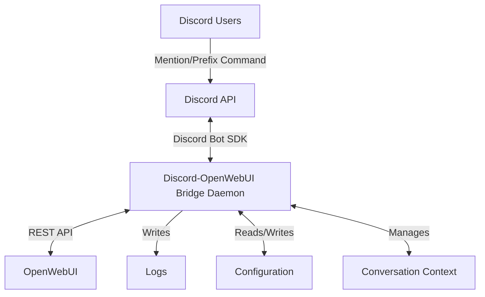
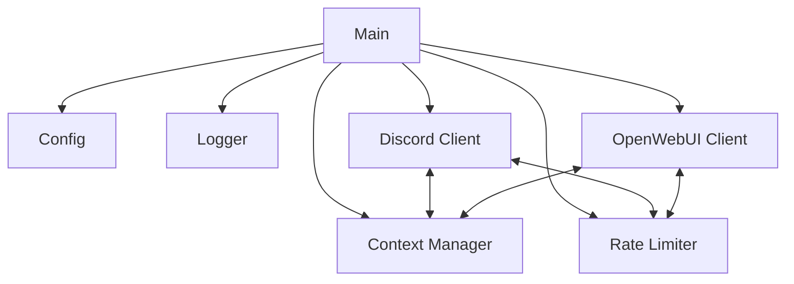
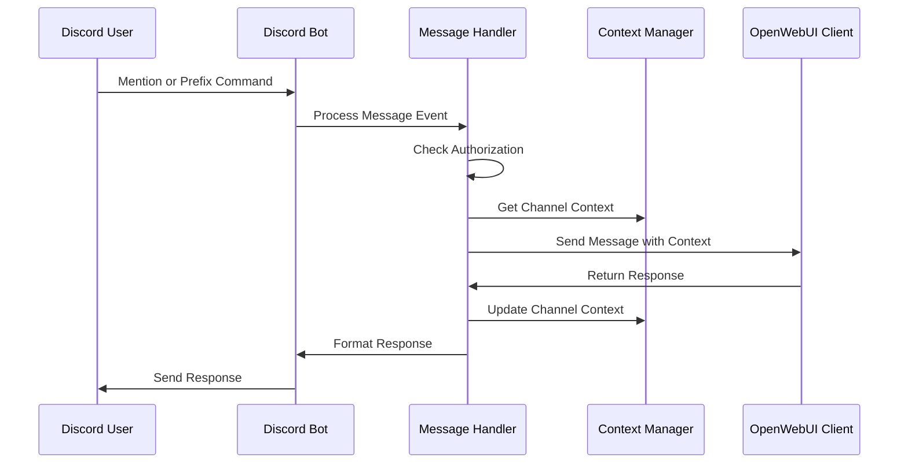
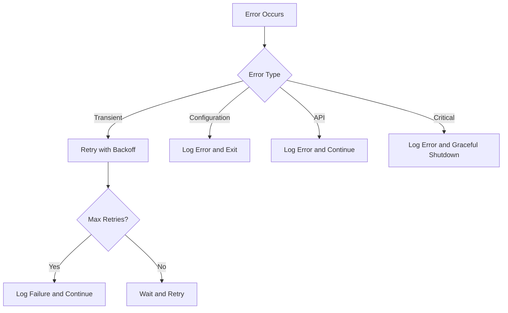
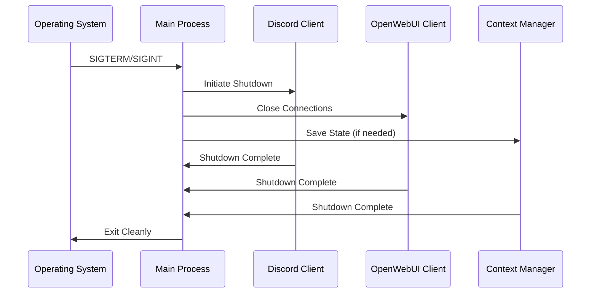
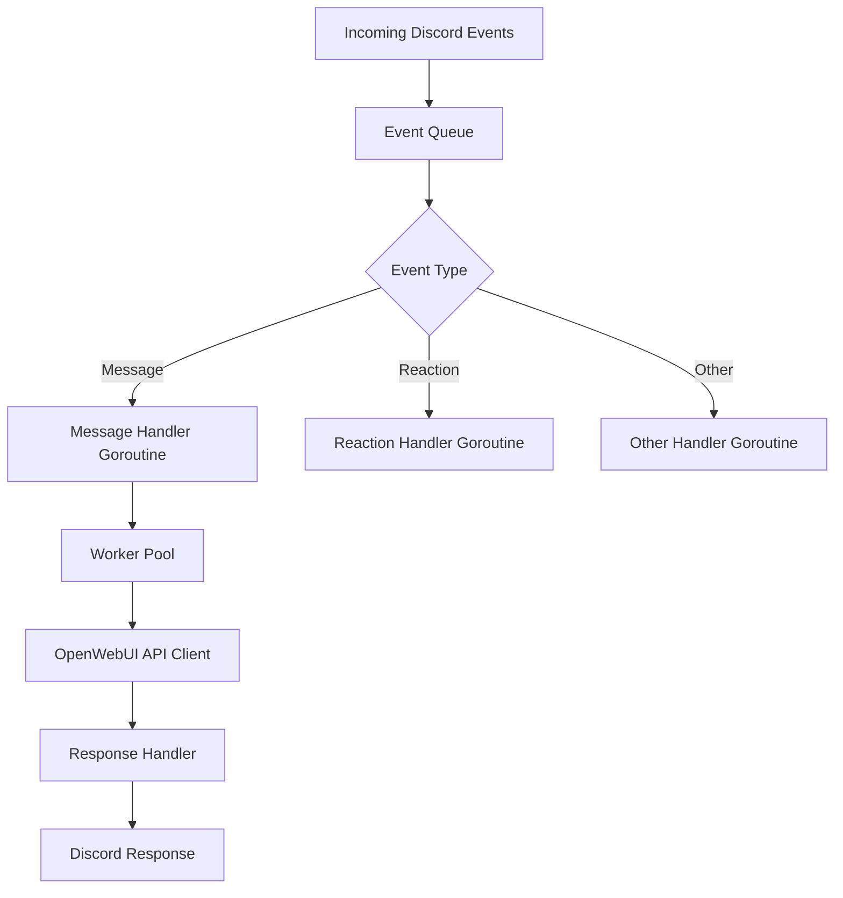

# Discord-OpenWebUI Bridge: Detailed Architecture Plan

## 1. System Overview

The system will be a production-grade Golang daemon that bridges Discord and OpenWebUI, allowing users in authorized Discord channels to interact with OpenWebUI through mentions or prefix commands. The daemon will maintain conversation context per channel, limited to the last ~20 minutes of communication.



## 2. Core Components

### 2.1. Application Structure



### 2.2. Directory Structure

```
openwebui-discord/
├── cmd/
│   └── openwebui-discord/
│       └── main.go
├── internal/
│   ├── config/
│   │   └── config.go
│   ├── discord/
│   │   ├── client.go
│   │   └── handler.go
│   ├── openwebui/
│   │   ├── client.go
│   │   └── types.go
│   ├── context/
│   │   └── manager.go
│   ├── ratelimit/
│   │   └── limiter.go
│   └── logger/
│       └── logger.go
├── pkg/
│   └── utils/
│       ├── shutdown.go
│       └── errors.go
├── configs/
│   └── config.yaml.example
├── go.mod
├── go.sum
└── README.md
```

## 3. Detailed Component Design

### 3.1. Configuration System

The configuration system will support multiple sources with the following priority:
1. Command-line flags
2. Environment variables
3. Configuration file (YAML)

```go
type Config struct {
    Discord struct {
        Token           string   `yaml:"token" env:"DISCORD_TOKEN"`
        AuthorizedGuilds []string `yaml:"authorized_guilds" env:"DISCORD_AUTHORIZED_GUILDS"`
        AuthorizedChannels []string `yaml:"authorized_channels" env:"DISCORD_AUTHORIZED_CHANNELS"`
        CommandPrefix   string   `yaml:"command_prefix" env:"DISCORD_COMMAND_PREFIX"`
    } `yaml:"discord"`
    
    OpenWebUI struct {
        Endpoint  string `yaml:"endpoint" env:"OPENWEBUI_ENDPOINT"`
        APIKey    string `yaml:"api_key" env:"OPENWEBUI_API_KEY"`
        Model     string `yaml:"model" env:"OPENWEBUI_MODEL"`
        Timeout   int    `yaml:"timeout" env:"OPENWEBUI_TIMEOUT"`
    } `yaml:"openwebui"`
    
    Context struct {
        MaxAgeMinutes int `yaml:"max_age_minutes" env:"CONTEXT_MAX_AGE_MINUTES"`
    } `yaml:"context"`
    
    RateLimit struct {
        RequestsPerMinute int `yaml:"requests_per_minute" env:"RATE_LIMIT_REQUESTS_PER_MINUTE"`
    } `yaml:"rate_limit"`
    
    Logging struct {
        Level  string `yaml:"level" env:"LOG_LEVEL"`
        Format string `yaml:"format" env:"LOG_FORMAT"`
        File   string `yaml:"file" env:"LOG_FILE"`
    } `yaml:"logging"`
}
```

### 3.2. Discord Client

The Discord client will handle:
- Connection to Discord API
- Message event handling
- Command parsing
- Authorization checks
- Response sending



### 3.3. OpenWebUI Client

The OpenWebUI client will:
- Handle API communication
- Format requests according to OpenWebUI API
- Process responses
- Handle errors and retries

### 3.4. Context Manager

The context manager will:
- Maintain conversation history per channel
- Enforce time-based context limits (~20 minutes)
- Optimize memory usage by pruning old messages
- Provide context for new requests

```go
type Message struct {
    Role      string    `json:"role"`
    Content   string    `json:"content"`
    Timestamp time.Time `json:"timestamp"`
}

type ChannelContext struct {
    ChannelID  string    `json:"channel_id"`
    Messages   []Message `json:"messages"`
    LastActive time.Time `json:"last_active"`
}
```

### 3.5. Rate Limiter

The rate limiter will:
- Enforce rate limits for Discord API
- Enforce rate limits for OpenWebUI API
- Implement token bucket algorithm
- Support per-channel and global limits

### 3.6. Logger

The logger will provide:
- Structured logging (JSON format)
- Configurable verbosity levels
- File and console output
- Context-aware logging

## 4. Error Handling & Recovery



### 4.1. Error Categories

1. **Transient Errors**: Network issues, temporary API unavailability
   - Implement exponential backoff retry
   - Log warnings

2. **Configuration Errors**: Missing credentials, invalid settings
   - Log fatal errors
   - Exit with descriptive message

3. **API Errors**: Rate limiting, authentication failures
   - Log errors
   - Implement appropriate recovery strategies

4. **Critical Errors**: Unrecoverable system issues
   - Log fatal errors
   - Initiate graceful shutdown

## 5. Graceful Shutdown



### 5.1. Shutdown Process

1. Capture OS signals (SIGTERM, SIGINT)
2. Stop accepting new requests
3. Complete in-flight requests with timeout
4. Close connections and release resources
5. Flush logs
6. Exit cleanly

## 6. Concurrency Model



### 6.1. Concurrency Patterns

1. **Worker Pool**: Process OpenWebUI requests concurrently with controlled parallelism
2. **Context Propagation**: Use Go's context.Context throughout the application
3. **Synchronization**: Use mutexes and channels for safe concurrent access
4. **Cancellation**: Support request cancellation and timeouts

## 7. Implementation Plan

### 7.1. Phase 1: Core Infrastructure

1. Set up project structure
2. Implement configuration system
3. Set up logging infrastructure
4. Create basic Discord client
5. Create basic OpenWebUI client

### 7.2. Phase 2: Core Functionality

1. Implement message handling
2. Implement context management
3. Connect Discord and OpenWebUI clients
4. Add basic error handling

### 7.3. Phase 3: Production Features

1. Implement rate limiting
2. Add comprehensive error handling
3. Implement graceful shutdown
4. Add reconnection logic with backoff

### 7.4. Phase 4: Refinement

1. Optimize memory usage
2. Improve logging and observability
3. Add documentation
4. Create example configurations

## 8. Deployment Considerations

### 8.1. System Requirements

- Go 1.20+ for building
- Linux server for deployment
- Sufficient memory for conversation contexts
- Network access to Discord and OpenWebUI APIs

### 8.2. Configuration Management

- Use environment variables for sensitive information
- Use configuration files for static settings
- Document all configuration options

### 8.3. Monitoring

- Log to standard output for container environments
- Implement health check endpoints
- Document common error scenarios and resolutions

## 9. Security Considerations

1. **Credential Management**:
   - Store API keys securely
   - Support environment variables for sensitive data
   - Never log sensitive information

2. **Authorization**:
   - Validate Discord users against allowed lists
   - Implement channel/server restrictions

3. **Rate Limiting**:
   - Protect against abuse
   - Implement fair usage policies

4. **Input Validation**:
   - Sanitize all user input
   - Validate configuration values